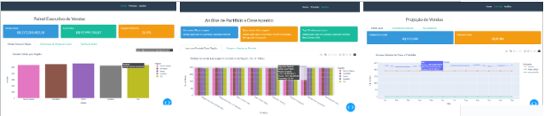

# Painel de Previsão de Vendas



[](https://www.python.org/)
[](https://dash.plotly.com/)
[]()
[]()

Projeto interativo desenvolvido com **Dash (Python)** para **prever vendas** e comparar os resultados com metas definidas.  
Combina **Machine Learning, Visualização de Dados e Design com Bootstrap**, ideal para demonstração de competências técnicas e visuais.

---

## Objetivo
Construir um pipeline completo de **previsão de vendas**, desde pré-processamento e treinamento de modelo até **visualização interativa** em um painel web responsivo.  
As etapas detalhadas estão documentadas em [`pipeline.md`](pipeline.md).

---

## Estrutura do Projeto

```text
Dash_model/
├── main.py                     # Inicializa a aplicação e a navbar
├── app.py                      # Configuração do Dash e tema
├── data/
│   ├── vendas.csv               # Dados simulados de vendas
│   └── meta_regional.csv        # Metas regionais
├── modelos/
│   └── modelo_vendas.pkl       # Modelo de Machine Learning treinado
├── pages/
│   ├── __init__.py
│   ├── home.py                 # Painel Executivo com KPIs
│   ├── previsao.py             # Previsão de Vendas
│   └── analise.py              # Análise de Portfólio e Insights
├── assets/
│   └── main.css                # Estilos personalizados (Bootstrap Flatly)
├── pipeline.md                 # Etapas detalhadas do desenvolvimento
└── README.md                   # Este arquivo
````

---

## Configuração do Ambiente

### Criar e ativar ambiente virtual

```bash
python -m venv venv_dash
venv_dash\Scripts\activate   # Windows
# ou
source venv_dash/bin/activate  # Linux/macOS
```

### Instalar dependências

```bash
pip install dash dash-bootstrap-components plotly pandas scikit-learn joblib
```

### Executar o aplicativo

```bash
python main.py
```

O painel estará disponível em:
**[http://127.0.0.1:8050](http://127.0.0.1:8050)**

---

## Principais Tecnologias

| Categoria              | Ferramenta              |
| ---------------------- | ----------------------- |
| Framework Web          | Dash                    |
| Estilo e Layout        | Bootstrap (tema Flatly) |
| Visualização           | Plotly                  |
| Machine Learning       | Scikit-learn            |
| Serialização de Modelo | Joblib                  |
| Manipulação de Dados   | Pandas                  |

---

## Funcionalidades

* **Home:** KPIs de vendas, lucro e margem; gráficos por região e canal; tabela de dados interativa.
* **Previsão:** Filtros de região e canal; previsão usando modelo ML; comparativo Previsão vs Meta.
* **Análise:** Performance de produtos por canal e região; scatter plot Margem x Vendas; cards de insight.
* Tooltips padronizados com **valores monetários** e percentuais.
* Layout totalmente **responsivo**, com tema Flatly.
* Gráficos interativos e dinâmicos usando Plotly.

---

## Demonstração do Painel


---

## Publicação e Portfólio

* **GitHub:** [Repositório do Projeto](https://github.com/ene-araujo/Dash_model)
* **LinkedIn:** Post destacando aprendizado, desafios e resultados.
  Sugestão de hashtags:

  ```
  #DataScience #Python #Dash #Portfolio #MachineLearning #OpenToWork
  ```

---

## Próximas Expansões

* Upload de arquivos CSV com dados reais.
* Histórico de previsões e armazenamento local.
* Dashboards multi-produto ou multi-região.
* Análise avançada de portfólio e margens por produto.

---

**Última atualização:** Outubro de 2025
**Autor:** Ananias Araujo — Projeto desenvolvido para portfólio público.
