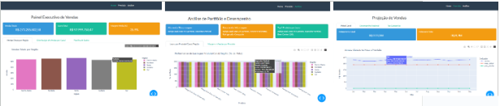

# Painel de Previsão de Vendas



[](https://www.python.org/)
[](https://dash.plotly.com/)
[]()
[]()

Projeto desenvolvido com Dash (Python) para previsão de vendas e acompanhamento de desempenho em relação a metas definidas.

A solução integra Machine Learning, análise de dados e visualização interativa, permitindo explorar indicadores de desempenho, comparar previsões com metas e analisar resultados por região, canal e portfólio.

## Demonstração Online

A aplicação está disponível para demonstração pública:

https://painel-previsao-vendas.onrender.com/

---

# Visão Geral

## Objetivo

O objetivo do projeto foi construir um fluxo completo de análise preditiva, contemplando:

* Preparação e tratamento dos dados.
* Treinamento de modelo de Machine Learning.
* Geração de previsões de vendas.
* Construção de dashboards interativos.
* Comparação entre resultados previstos e metas de negócio.

Além do aspecto analítico, o projeto também explora a transformação de modelos preditivos em uma interface acessível para apoio à tomada de decisão.

As etapas detalhadas estão documentadas em [`pipeline.md`](pipeline.md).

---

## Funcionalidades

### Painel Executivo

* Indicadores de vendas, lucro e margem.
* Visão consolidada por região e canal.
* Gráficos interativos para acompanhamento de desempenho.
* Tabela exploratória dos dados.

### Previsão de Vendas

* Seleção de filtros por região e canal.
* Geração de previsões utilizando modelo treinado.
* Comparativo entre previsão e meta estabelecida.

### Análise de Portfólio

* Avaliação de desempenho por produto.
* Comparação entre regiões e canais.
* Scatter plot para análise de margem versus vendas.
* Insights visuais para apoio à análise.

### Experiência do Usuário

* Layout responsivo.
* Componentes estilizados com Bootstrap.
* Gráficos interativos utilizando Plotly.
* Tooltips padronizados para indicadores monetários e percentuais.

---

## Arquitetura do Projeto

```text
Dash_model/
├── main.py                     # Inicializa a aplicação e a navbar
├── app.py                      # Configuração do Dash e tema
├── data/
│   ├── vendas.csv              # Dados simulados de vendas
│   └── meta_regional.csv       # Metas regionais
├── modelos/
│   └── modelo_vendas.pkl       # Modelo de Machine Learning treinado
├── pages/
│   ├── __init__.py
│   ├── home.py                 # Painel Executivo com KPIs
│   ├── previsao.py             # Previsão de Vendas
│   └── analise.py              # Análise de Portfólio e Insights
├── assets/
│   └── main.css                # Estilos personalizados (Bootstrap Flatly)
├── pipeline.md                 # Etapas detalhadas do desenvolvimento
└── README.md                   # Este arquivo
```

---

## Tecnologias Utilizadas

| Categoria               | Ferramenta         |
| ----------------------- | ------------------ |
| Linguagem               | Python             |
| Dashboard Web           | Dash               |
| Visualização de Dados   | Plotly             |
| Machine Learning        | Scikit-learn       |
| Manipulação de Dados    | Pandas             |
| Serialização de Modelos | Joblib             |
| Interface e Layout      | Bootstrap (Flatly) |

---

## Competências Aplicadas

Durante o desenvolvimento deste projeto foram praticados conceitos relacionados a:

* Python
* Ciência de Dados
* Análise de Dados
* Machine Learning
* Modelagem Preditiva
* Dashboards Analíticos
* Visualização de Dados
* Scikit-learn
* Pandas
* Dash
* Plotly
* Bootstrap
* Indicadores de Desempenho (KPIs)

---

## Aprendizados

Este projeto permitiu aplicar conceitos de análise de dados, modelagem preditiva e visualização de informações em uma solução integrada.

Entre os principais aprendizados estão:

* Construção de pipelines de preparação de dados.
* Treinamento e utilização de modelos preditivos com Scikit-learn.
* Integração entre Machine Learning e aplicações web.
* Desenvolvimento de dashboards interativos com Dash e Plotly.
* Comunicação visual de métricas e indicadores de negócio.
* Organização de projetos Python voltados para análise de dados.

---

## Configuração do Ambiente

### Criar e ativar ambiente virtual

```bash
python -m venv venv_dash
```

Windows:

```bash
venv_dash\Scripts\activate
```

Linux/macOS:

```bash
source venv_dash/bin/activate
```

### Instalar dependências

```bash
pip install dash dash-bootstrap-components plotly pandas scikit-learn joblib
```

### Executar o aplicativo

```bash
python main.py
```

O painel estará disponível em:

**http://127.0.0.1:8050**

---

## Demonstração do Painel


---

## Próximas Expansões

* Upload de arquivos CSV com dados reais.
* Histórico de previsões e armazenamento local.
* Dashboards multi-produto ou multi-região.
* Análise avançada de portfólio e margens por produto.
* Integração com banco de dados.
* Evolução das métricas e análises preditivas.

---

## Autor

**Ananias Araujo**

Projeto desenvolvido para aprendizado prático de Machine Learning, análise de dados e construção de dashboards interativos utilizando Python.

---

**Última atualização:** Junho de 2026

